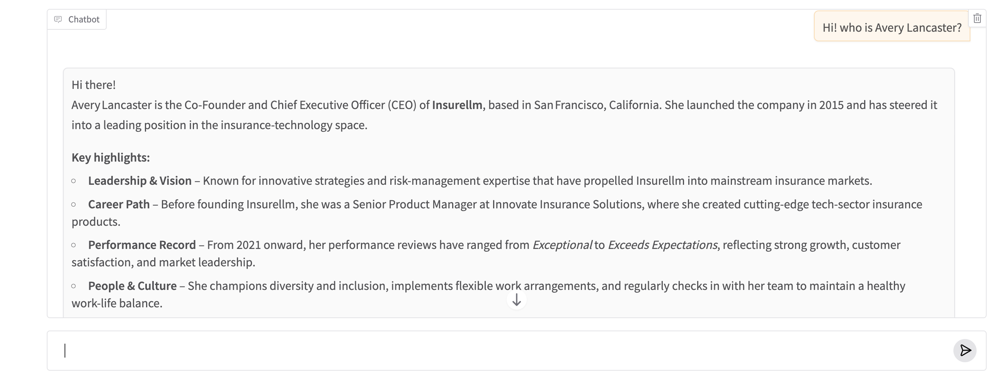

# Basic RAG Chatbot with Ollama and Gradio

This project implements a simple RAG-style chatbot for an insurance knowledge base. Documents are loaded from a local knowledge base, relevant context is retrieved using keyword matching, and responses are generated using a local Ollama LLM through a Gradio interface.

## Features

- Local knowledge-base retrieval
- Context-aware question answering
- Ollama LLM integration
- Gradio chatbot interface

## Tech Stack

Python • Ollama • OpenAI SDK • Gradio

## Vector-Based RAG Chatbot

This version extends the basic chatbot into a semantic RAG pipeline. It loads local documents, splits them into chunks, creates embeddings, stores them in ChromaDB, retrieves relevant context with LangChain, and generates answers using a local Ollama model.

### Additional Features

- Semantic search with vector embeddings
- ChromaDB vector database
- LangChain retriever
- Local Ollama LLM
- Gradio chatbot interface

### Additional Tech Stack

LangChain • ChromaDB • Hugging Face Embeddings