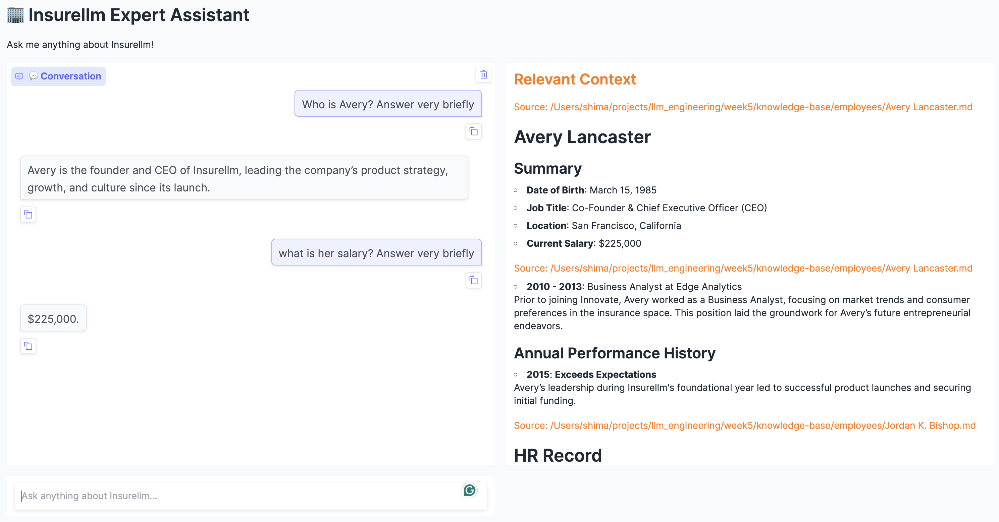
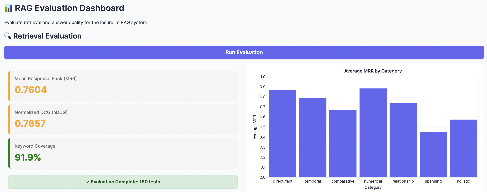
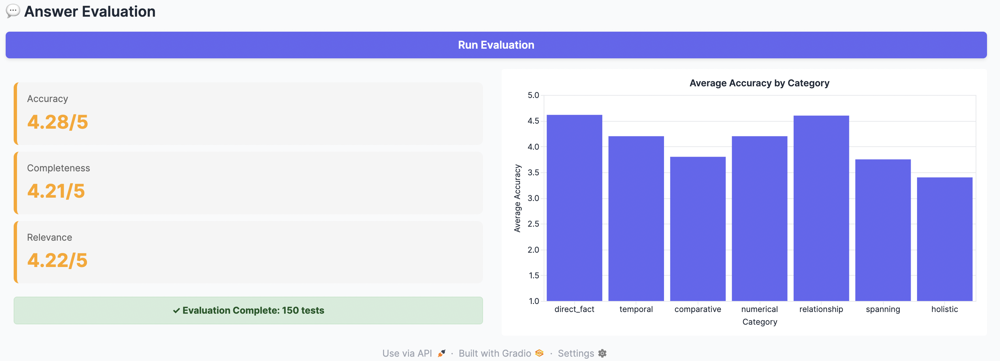

# RAG Chatbot Projects with Ollama, Gradio, ChromaDB, and Evaluation

This repository contains four progressive RAG projects for an insurance knowledge base, starting from a basic chatbot and ending with a RAG evaluation dashboard.

---

## 1. Basic RAG Chatbot with Ollama and Gradio


This project implements a simple RAG-style chatbot for an insurance knowledge base. It loads local documents, retrieves relevant context using keyword matching, and generates answers using a local Ollama LLM through a Gradio interface. 

### Features

* Local knowledge-base retrieval
* Context-aware question answering
* Ollama LLM integration
* Gradio chatbot interface

### Tech Stack

Python • Ollama • OpenAI SDK • Gradio

**Related notebook:** `keyword_retrieval_chatbot.ipynb`
---

## 2. Vector-Based RAG Chatbot


This version extends the basic chatbot into a semantic RAG pipeline. It loads local documents, splits them into chunks, creates embeddings, stores them in ChromaDB, retrieves relevant context with LangChain, and generates answers using a local Ollama model.

### Features

* Semantic search with vector embeddings
* ChromaDB vector database
* LangChain retriever
* Local Ollama LLM
* Gradio chatbot interface

### Tech Stack

LangChain • ChromaDB • Hugging Face Embeddings • Ollama • Gradio
**Related notebook:** `vector_rag_chatbot.ipynb`

---

## 3. Insurellm Expert Assistant Web App



This version turns the vector-based RAG chatbot into a reusable Gradio web app. Users can ask questions about the Insurellm knowledge base, receive answers from a local Ollama model, and view the retrieved source context used to generate each response.

### Run

Build the vector database:

```bash
uv run implementation/ingest.py
```

Launch the app:

```bash
uv run app.py
```

### Project Structure

* `implementation/ingest.py`: loads documents, creates chunks, vectorizes them, and stores them in ChromaDB
* `implementation/answer.py`: retrieves relevant context and generates answers
* `app.py`: launches the Gradio chatbot interface

---

## 4. RAG Evaluation Dashboard





This project adds an evaluation dashboard for the Insurellm RAG system. It evaluates retrieval quality and answer quality, then displays the results in a Gradio dashboard with summary cards and category-level charts.

### Run

First, run the evaluation test preparation notebook:

```bash
evaluation_testset.ipynb
```

Then launch the evaluation dashboard:

```bash
uv run evaluator.py
```

### Project Structure

* `evaluation_testset.ipynb`: prepares the evaluation test set
* `evaluator.py`: launches the Gradio evaluation dashboard
* `evaluation/eval.py`: runs retrieval and answer evaluation logic

---

## Difference from the Notebooks

The notebook versions were used for experimentation and learning. The final versions are organized into reusable Python files for ingestion, retrieval, answering, app deployment, and evaluation.
