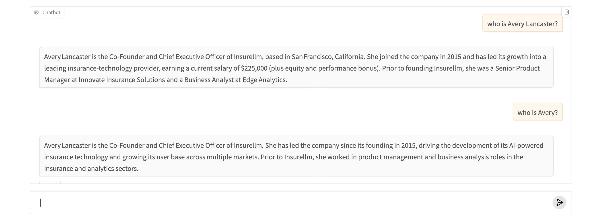

# Basic RAG Chatbot with Ollama and Gradio

This project implements a simple RAG-style chatbot for an insurance knowledge base. Documents are loaded from a local knowledge base, relevant context is retrieved using keyword matching, and responses are generated using a local Ollama LLM through a Gradio interface.

## Features

- Local knowledge-base retrieval
- Context-aware question answering
- Ollama LLM integration
- Gradio chatbot interface

## Tech Stack

Python • Ollama • OpenAI SDK • Gradio