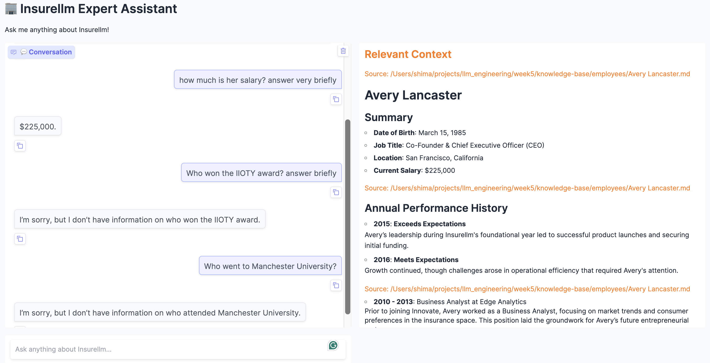
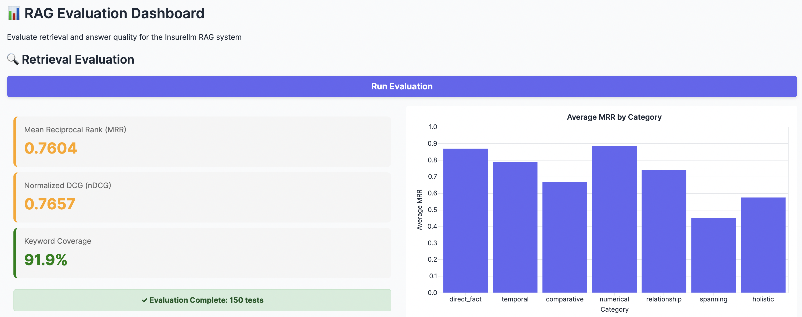
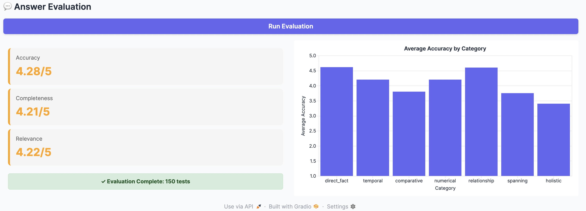
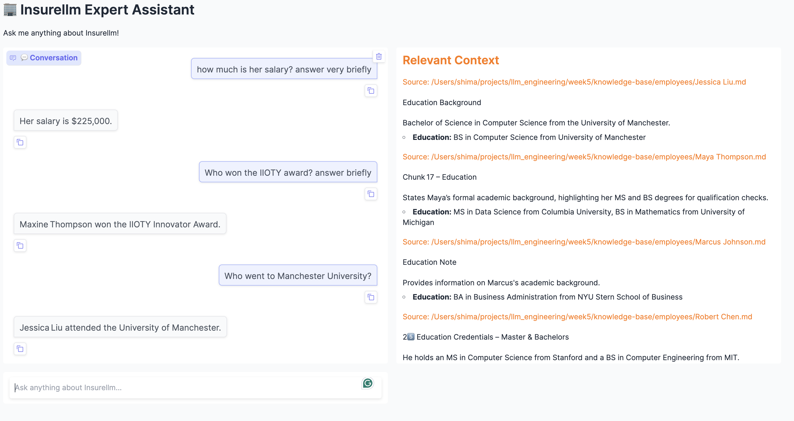

# RAG Knowledge Assistant

A retrieval-augmented question-answering system over an insurance knowledge base, running fully locally — semantic retrieval with ChromaDB, generation with Ollama, and an evaluation dashboard that scores both retrieval and answer quality.



## Results

Evaluated on 150 questions across 7 question categories.

<!-- **Retrieval**

| Metric | Score | Measures |
|---|---|---|
| Mean Reciprocal Rank | **0.7604** | How highly the correct source ranks |
| Normalized DCG | **0.7657** | Rank-weighted relevance across retrieved chunks |
| Keyword coverage | **91.9%** | Expected terms present in retrieved context |

**Answer quality** (LLM judge, 1–5 scale)

| Metric | Score |
|---|---|
| Accuracy | **4.28 / 5** |
| Completeness | **4.21 / 5** |
| Relevance | **4.22 / 5** | -->


**Retrieval Evaluation and Answer Quality Evaluation (Using an LLM as a Judge)**






<!-- Aggregate scores hid the interesting failure. Broken down by category, retrieval is strong on questions answerable from a single passage — `numerical` (0.89) and `direct_fact` (0.87) — but drops sharply on `spanning` (0.45) and `holistic` (0.58), where the answer is distributed across several documents. Answer quality follows the same shape: `holistic` scores 3.4/5 against 4.6/5 for `direct_fact`. The bottleneck is retrieval, not generation — when the right chunks are found, the model uses them well. -->

## Quickstart

Requires [uv](https://docs.astral.sh/uv/) and a running [Ollama](https://ollama.com) instance.

```bash
git clone https://github.com/shsargordi/RAG-knowledge-assistant.git
cd RAG-knowledge-assistant
uv sync

ollama pull llama3.2

uv run implementation/ingest.py   # build the vector store
uv run app.py                    
```

## How it works

```
knowledge-base/*.md
        │
        ▼
   ingest.py ──► chunk ──► MiniLM embeddings ──► ChromaDB
                                                     │
   user question ──► retrieve top-k ──► prompt with context ──► Ollama ──► answer + sources
```

- **Ingestion** (`implementation/ingest.py`) — loads markdown documents, splits them with a recursive character splitter, embeds each chunk with `all-MiniLM-L6-v2`, and persists to a local ChromaDB collection.
- **Answering** (`implementation/answer.py`) — embeds the query, retrieves the top-k nearest chunks, and injects them into a grounded prompt. Retrieved chunks are returned alongside the answer, so the source of every response is visible.
- **Interface** (`app.py`) — Gradio chat UI displaying both the answer and the context used to produce it.

## Evaluation

<!-- The evaluation harness scores the pipeline on two axes:

- **Retrieval quality** — for each test question, how highly the ground-truth source ranks among retrieved chunks (MRR), rank-weighted relevance across the full result set (nDCG), and whether expected terms appear in the retrieved context at all (keyword coverage).
- **Answer quality** — an LLM judge scores each generated answer for accuracy, completeness, and relevance against the retrieved context, catching answers that sound correct but aren't grounded. -->

<!-- The test set spans seven question types: `direct_fact`, `temporal`, `comparative`, `numerical`, `relationship`, `spanning`, and `holistic`. Scoring by category rather than in aggregate is what exposed the multi-document retrieval gap — a single averaged number looked acceptable. -->

```bash
uv run evaluation/build_testset.py   # regenerate the test set
uv run evaluator.py                 
```


## pro_implementation

A second, improved pipeline alongside `implementation/`:

| Step | `implementation/` | `pro_implementation/` |
|---|---|---|
| Framework | LangChain (loaders, splitters, Chroma wrapper) | No LangChain — raw `chromadb`, `openai` client, `litellm` |
| Document loading | LangChain `DirectoryLoader`/`TextLoader` | Plain Python file reading |
| Chunking | `RecursiveCharacterTextSplitter` — fixed-size (500 chars, 200 overlap) | LLM (`gpt-oss:20b`) semantically splits each doc into headline + summary + original text |
| Embeddings | HuggingFace `all-MiniLM-L6-v2` (via LangChain) | Ollama `nomic-embed-text` (direct API call) |
| Vector store | LangChain's `Chroma` wrapper | Raw `chromadb.PersistentClient` |
| Query rewriting | None — raw question used as-is | LLM rewrites the question using conversation history before searching |
| Retrieval | Single vector search | Searches with both original and rewritten question, merges results |
| Reranking | None — raw vector-search order | LLM reranks merged chunks by relevance before answering |
| Generation model | Local `gpt-oss:20b` via `ChatOllama` | Groq-hosted `gpt-oss-120b` via `litellm` (cloud) |
| History handling | Concatenated into retrieval query as plain text | Passed through rewrite step + full chat history in final prompt |



Above are two questions that our first implementation at `implementation/` couldn't answer but that our second implementation at `pro_implementation/` answered correctly.

To use it, switch the import in **`app.py`** and **`evaluation/eval.py`**:
```python
# from implementation.answer import answer_question, fetch_context
from pro_implementation.answer import answer_question, fetch_context
```

## Project structure

```
implementation/
  ingest.py          document loading, chunking, embedding, persistence
  answer.py          retrieval + grounded generation
evaluation/
  eval.py            retrieval and answer-quality metrics
  build_testset.py   generates the evaluation test set
app.py               chat interface
evaluator.py         evaluation dashboard
knowledge-base/      source documents
notebooks/           exploratory work (see below)
```

<!-- ## Stack

Python · LangChain · ChromaDB · Sentence Transformers · Ollama · Gradio -->

<!-- ## Notebooks

`notebooks/` contains the exploratory work behind the implementation: an initial keyword-matching prototype (`keyword_retrieval_chatbot.ipynb`) and the first vector-search pipeline (`vector_rag_chatbot.ipynb`). The production code in `implementation/` supersedes both. -->

<!-- ## Roadmap

- [ ] Cross-encoder reranking over a wider candidate set, targeting `spanning` and `holistic` recall
- [ ] Hybrid retrieval (BM25 + dense) for exact-term and numerical queries
- [ ] Keyword baseline scored on the same 150 questions, for a like-for-like comparison
- [ ] Chunking strategy sweep, scored against the test set -->

<!-- ## License

MIT -->
